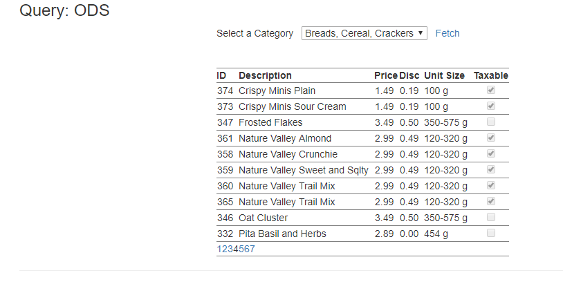
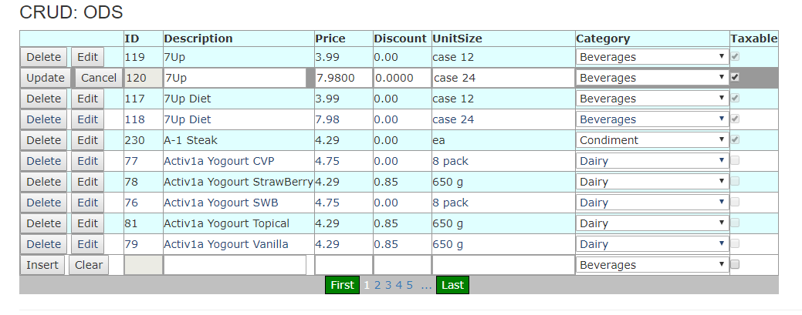

# Entity Framework - Code First CRUD Exercise (3 Marks)

> Private GitHub Repo Only

Be aware that this is the first exercise in a series of cumulative exercises - you must be prepared to complete each exercise in light of the possibility that any given exercise may depend on the correct implementation of previous exercises. Place this work in your private Exercise repository. Remember to handle your bin files through the Git Shell. All commits must have meaningful messages.

## Setup

Create a new VS Solution called GroceryListSolution.  Place a .Net Framework web application project called GroceryListWebApp. Change the Authentication to Individual User Accounts while creating the project. Place a .Net Framework library class project into this solution called GroceryListSystem. Add 4 folders to the GroceryListSystem project and name them "Entities", "ViewModels", "DAL" and "BLL". Add the NuGet package for EntityFramework to your GroceryListSystem. Add a new folder to you web application called ExercisePages. Commit your work.

## Entities

Create DAL and Entity classes using reverse engineering. Create these entity classes in the Entity folder to ensure they have the correct namespace generated. Name the context class GroceryListContext. Use GroceryListDB as the connection string name. `[Required]`, and `[StringLength]` annotations in your entities will not have error messages; you must place an ErrorMessage parameter within each annotation that is appropriate for and specific to the property being annotated. Restricted your DAL and Entity classes to `internal` project access only. Commit your work when you are finished with setting up your entities.

Add the following `[NotMapped]` properties:

- **Customer**
  - FullName: returns the customer full name as LastName, Firstname
  - CityCustomer: returns the city and customer full name as City: LastName, Firstname
- **Picker**
  - FullName: returns the picker full name as LastName, Firstname
- **Product**
  - DescriptionUnitSize: returns the description and unitsize as Description (UnitSize)
- **Store**
  - CityLocation: returns the city and location as City:Location

## Context Class

Move the Context class to the DAL folder from the Entities folder; alter the namespace to GroceryListSystem.DAL; and include any necessary using statements. Remove the Context class from the entity folder. Create an appropriate web connection string file pointing to the database GroceryList. Move the existing connection string in the web config file to your web connection string file. Add the `<context>` tag in the web.config file under the `<entityFramework>` tag. The context class is to be restricted to internal project access only. Commit your work.

## BLL Controller Classes

Create BLL controller classes for the Product and Category entities. The classes must expose methods for that can be used by the ObjectDataSource control. Both classses must have appropriate `x_List()` and `x_Get(int keyvalue)` methods. The ProductController must have a method with an integer parameter (representing a category ID) that returns all the products within that category. The ProductController must implement `x_Add(Product)`, `x_Update(Product)`, `x_Delete(Product)` and `x_Delete(int productid)` methods. The overloaded `x_Delete(int productid)` must do the actual delete of the product record of the database. Create appropriate ViewModel classes needed by the controller methods. Commit your work.

## Web Application: MessageUserControl

Implement the MessageUserControl supplied for this course. The control must be used on all pages to handle errors. Commit your work.

## Web Page: Query

Create a web page that will display the product data related to a supplied category. Use only ODS wired controls to handle the data. Categories should be sorted by Description and displayed in a drop down list. Display the product data in a customized data control which obtains its input parameter value from the drop down list. Your display requires appropriate page title, labels and layout/formatting. You will need a button on your page to force a post back. This page must be accessiable by the site master menu. Commit your work.

## Web Page: CRUD

Create a web page that will maintain the Product entity. The web page must insert, update or delete records to the Product entity. Handle the Category data via an appropriate dropdownlist. Use a ListView control wired through an ObjectDataSource control to maintain the data. Appropriate formatting is required on the display lines. This page must be accessiable by the site master menu. Commit your work.

